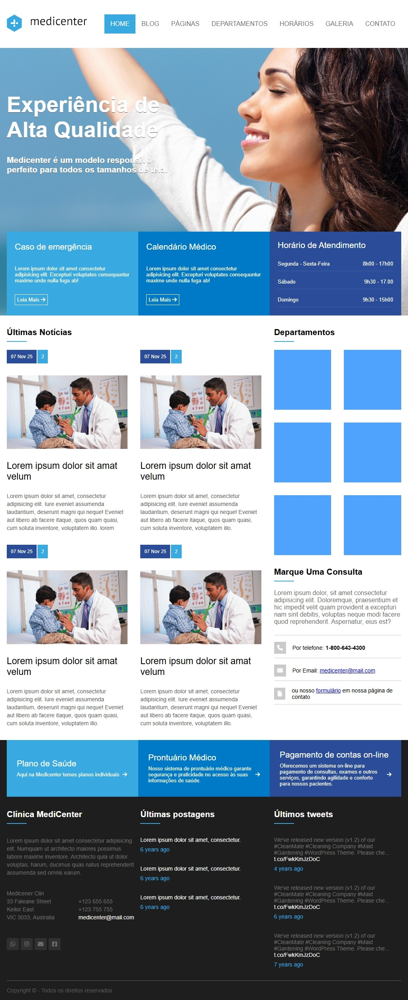
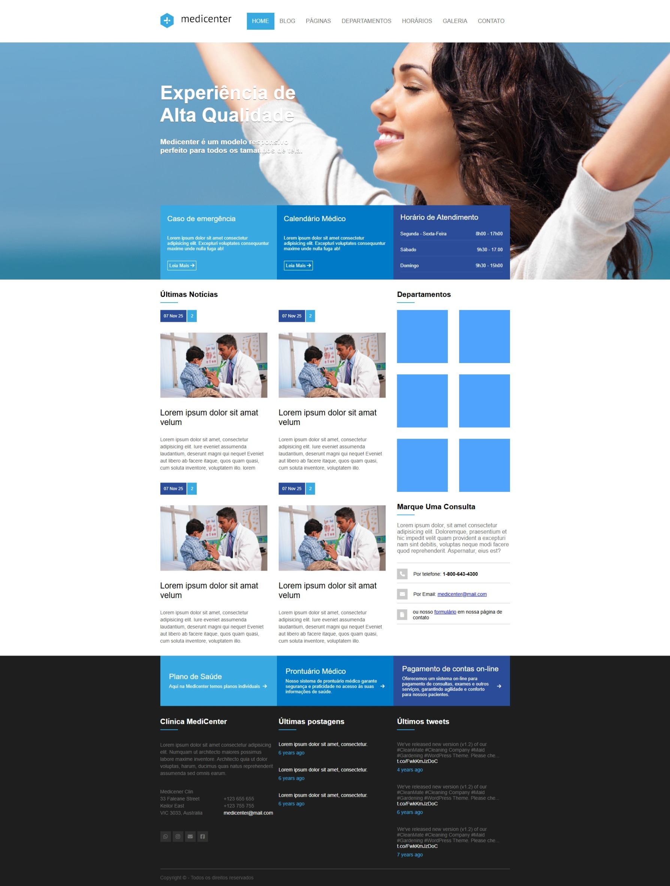

# Projetos do Curso B7Web

Bem-vindo(a) ao meu repositório de estudos da **[B7Web](https://b7web.com.br/)**!  
Aqui estão reunidos os projetos e exercícios que estou desenvolvendo ao longo do curso, com foco em **HTML**, **CSS**, **JavaScript**.

## 📚 Sobre o curso

O curso da **B7Web** é uma formação completa para quem deseja se tornar um **desenvolvedor web full stack**, com conteúdos práticos e projetos reais.

## 💡 Objetivo do repositório

Este repositório foi criado para:
- Organizar meus estudos e projetos desenvolvidos durante o curso;
- Demonstrar minha evolução como desenvolvedora;
- Servir como portfólio de aprendizado e prática.

## 🏥 Projeto: Medicenter

O **Medicenter** é um dos projetos desenvolvidos durante o curso.  
Ele simula um **site institucional de uma clínica médica**, com foco em **design responsivo**, **estrutura HTML semântica** e **boas práticas de layout com CSS e Flexbox**.

Link: https://emillymoitinho.github.io/b7web-projects/medicenter/index.html

### 🧠 Tecnologias utilizadas:
- **HTML5**  
- **CSS3**  
- **Font Awesome**  
- **Responsividade (Media Queries)** 

#### 📱 Versão Mobile

#### 📱 Versão Tablet

#### 💻 Versão Desktop

